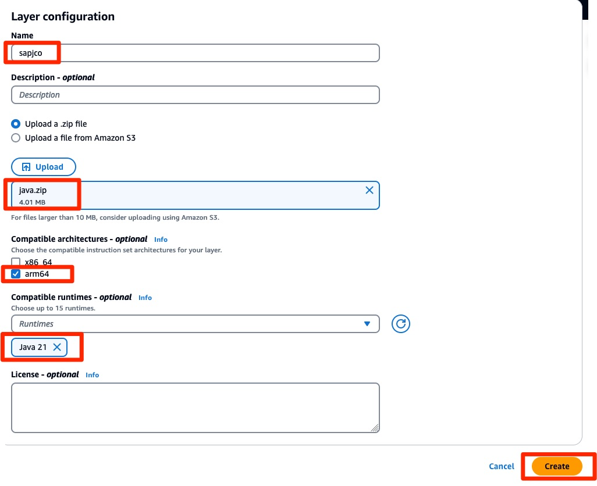

# Create a Lambda layer for SAP JCo

**Note:** This activity has to be done **once** only, regardless of any subsequent deployments.

Download the latest [SAP Java Connector](https://support.sap.com/en/product/connectors/jco.html) (e.g. version 3.1) to your local disk.
Make sure to select Linux for Intel, 64 bit!

Unzip the package:

Create a new folder “java” with sub-folder “lib” and add the highlighted files as follows:

Create a new .zip file based on this new folder structure. The .zip should look as follows inside

Go to the AWS console of your AWS target region. Navigate to AWS Lambda – Layers and hit “Create layer”:

As Name choose “**sapjco**” (mandatory) and select your recently created .zip file. Also tick Java 8 & 11 as runtimes:

Finish the wizard by pressing “Create”.