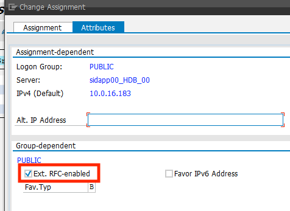

# Connect via SAP Messager Server

The SAP Message Server is responsible for load distribution in a multi application server setup.

To connect the monitor with the SAP Message Server, please go to AWS Secrets Manager and add the following properties to the connection secret:

"mshost" = Message Server Hostname / IP  
"msport" = Message Server Port (transaction smms)  
"group" = SAP Logon Group (transaction smlg)  

Make sure, that the logon group is also enabled for external RFC communcation:

Finally, force a config reload of the Lambda/monitor, as outlined here: [Troubleshooting](https://github.com/aws-samples/amazon-cloudwatch-monitor-for-sap-netweaver/blob/master/docs/Troubleshooting.md)