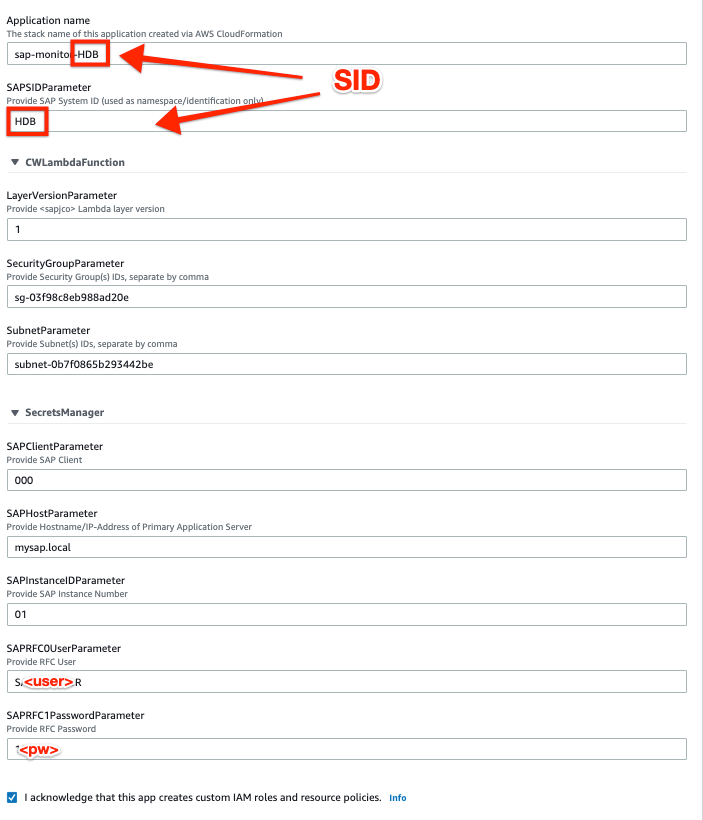
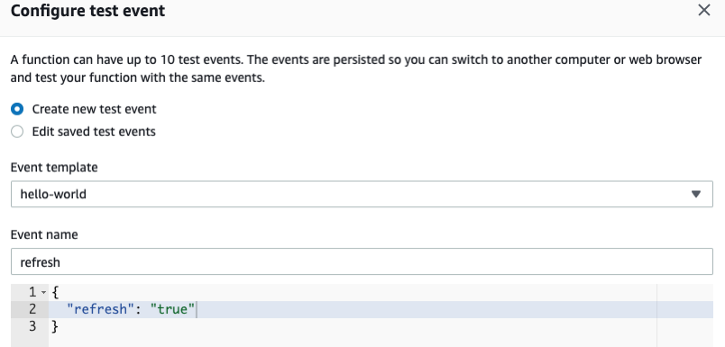
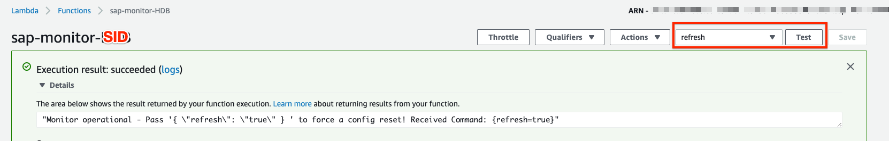
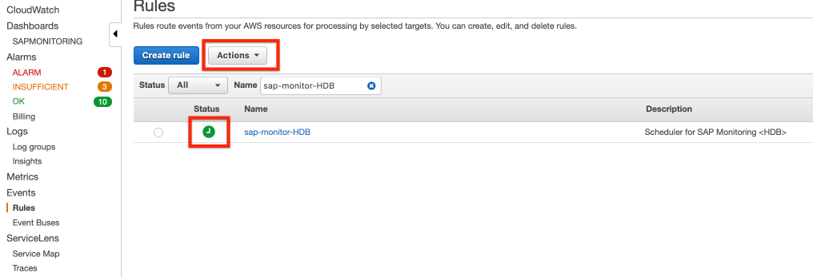
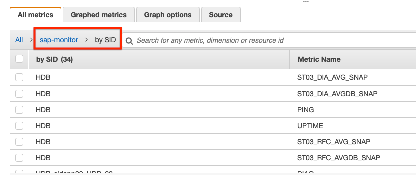
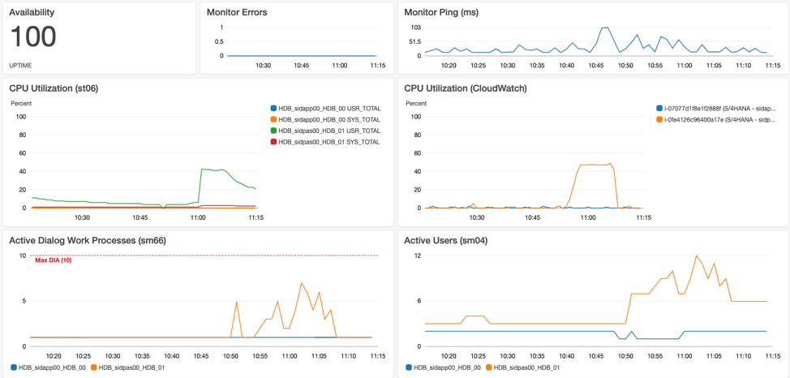
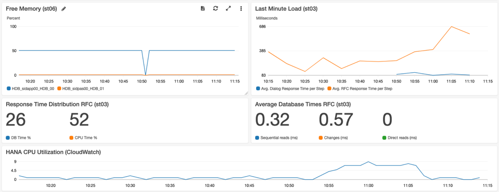
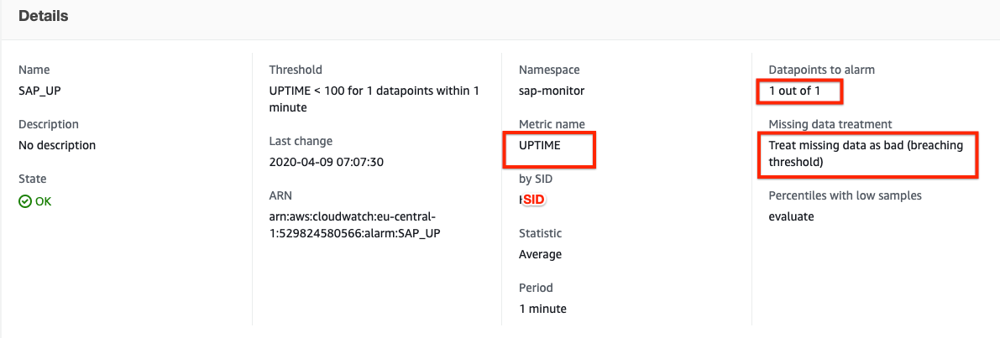

# Setting it up

## Step 1: Create an SAP User for Monitoring (SAPGUI)

Please refer to the [step-by-step guide](Create_SAP_Monitoring_User.md) and maintained list of required authorizations.

## Step 2: Create a Lambda layer for SAP JCo (console)

This activity has to be done once only, regardless of any subsequent deployments. 

Please refer to the [step-by-step guide](Create_AWS_Lambda_layer_for_SAP_Jco.md)

## Step 3: Deploy the solution (console)

For most AWS Regions, you can easily deploy the solution with the [AWS Serverless Application Repository](https://eu-central-1.console.aws.amazon.com/serverlessrepo/home?region=eu-central-1#/available-applications) by searching for **sap-monitor**. Make sure to tick **Show apps that create custom IAM roles**.

If this is not working in your Region, please deploy it manually by downloading and running the following AWS CloudFormation template
- [Frankfurt (eu-central-1)](https://github.com/aws-samples/amazon-cloudwatch-monitor-for-sap-netweaver/blob/master/packaged.yml)
  
  

Please carefully fill out all the necessary details, such as SAP System ID, Client, Host/IP-Address, Instance ID, RFC User/Password as well as Security Group(s) and Subnet(s) of your target VPC. Compare your inputs also with the respective EC2 settings for your SAP system. 

**Note:** You will have to deploy a single instance of this application per SAP System ID, if multiple systems shall be monitored!

In case of issues, please refer to the [Troubleshooting](Troubleshooting.md) guide. 

If you like to start /SDF/SMON yourself instead of automatically through the monitor, check the documentation for [manual scheduling](Schedule_SDF_SMON_manually.md).

## Step 4: Test the function (console)

Open the Lambda console, select **sap-monitor-\<SID\>** and choose **Test**. In the **Configure test event** page, choose **Create new test event** and enter *{“refresh”:true}*:

Hit **Test**. The expected output is shown below:

In case of issues, refer to the [Troubleshooting](Troubleshooting.md) guide.

## Step 5: Enable the Scheduler (console)

Open the Amazon CloudWatch console. In the navigation pane, choose **Rules**. Select the rule **sap-monitor-\<SID\>** and choose **Enable** as **Actions**, so that it runs periodically: 

## Step 6: Create a dashboard (console)

Open the Amazon CloudWatch console. In the navigation pane, choose Metrics. Under Custom Namespaces, you should now find your custom metrics, arranged by SID. You can select any metric and preview its output.

Navigate to Dashboards and press Create dashboard to setup a new custom dashboard. Choose Add widget and select the respective custom metrics from the list. Make sure to match the granularity and period. 

The resulting dashboards can look as follows

By the way, if desired, CloudWatch even allows you to [embed graphs](https://aws.amazon.com/de/blogs/devops/building-an-amazon-cloudwatch-dashboard-outside-of-the-aws-management-console/) into your webpage.

## Step 7: Create alarms

You can now create alarms and receive notifications, once desired thresholds are exceeded.

Start with a simple alarm to monitor the sap-monitor itself, by selecting the Lambda metric **Errors** for function **sap-monitor-\<SID\>** as follows
 

If you set up a corresponding [Amazon Simple Notification Service](https://docs.aws.amazon.com/AmazonCloudWatch/latest/monitoring/US_SetupSNS.html) (Amazon SNS) topic, you can choose to be notified via email when the monitoring is failing. Proceed with other alarms for metrics, that you like to closely pay attention to.
