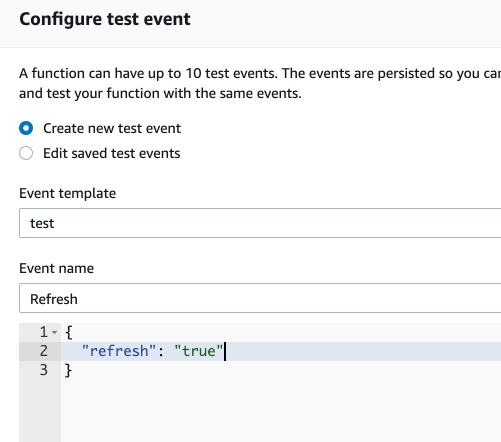
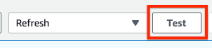

# Troubleshooting

In case of metrics are not available inside CloudWatch or Lambda Runtime Errors, make sure to check the Lambda Function and CloudWatch Logs - Log Group **/aws/lambda/sap-monitor-\<SID\>**.

You can always change your credentials or connection information (e.g. host) inside AWS Secrets Manager.

To force a config reload, simply pass the string "refresh":

For debugging purposes, temporarily add an environment variable - Key: DEBUG Value: true